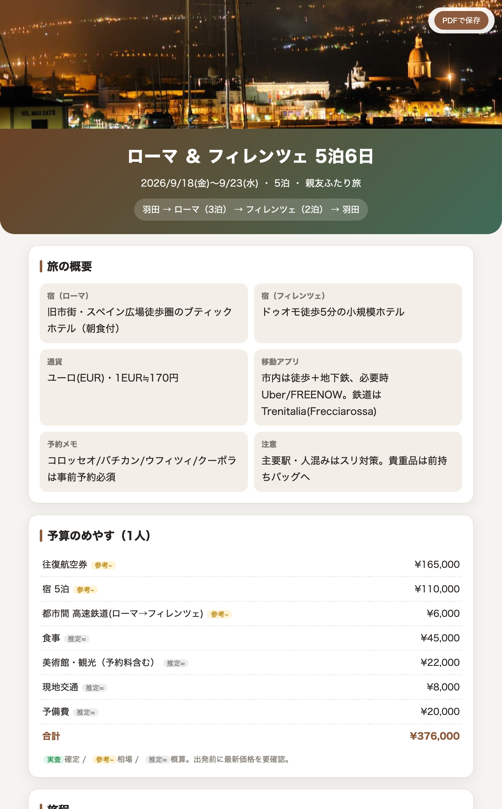

# Tabicraft — あなた専属の旅行プランナー for Claude Code

## こんな悩み、ありませんか？

- 行きたい場所はあるのに、**日程・移動・予約に落とし込むのが面倒**で腰が重い
- 毎回ゼロから**所要時間や料金を調べ直し**ていて時間がかかる
- 同行者の好みをうまく汲み取れない、**前回の好みを忘れてしまう**
- 気づけば**詰め込みすぎて疲れる**、または逆に予定を持て余す
- 旅の途中で次の予定を忘れてしまう

**Tabicraft は、あなたが「やりたいこと」を選ぶだけ。**
一番大変な〈実現可能性のチェックと、具体的なスケジュールへのまとめ上げ〉を引き受けます。
そして使うほど、あなたと同行者の好みを学習して賢くなります。

>[!IMPORTANT]
> 
> **必ず「叩き台」として使ってください！！！**
> 
> **「旅行が面倒すぎて楽してるな…」と疑われる恐れがあります！！！**
>
> 同行者に見せる前に、まずは自分で一度ざっと内容を調べて確認しましょう。
> ひと言ふた言あなたの意見を足して、「ここは譲れない」を語るほど、しおりはあなたらしく、株も上がります。

<p align="center">
  <a href="examples/brochure_example.png">
    
  </a>
  <br>
  <sub>完成する旅のしおりの一例（クリックで<a href="examples/brochure_example.png">全体PNG</a>）。親友とローマ＆フィレンツェ5泊6日。<br>サンプル写真は CC0／パブリックドメイン（<a href="examples/images/CREDITS.md">出典一覧</a>）。</sub>
</p>

---

## 使い方は、これだけ

```text
1. インストール:   ./install.sh を実行するだけ
2. 計画スタート:   Claude Code で「旅行の計画したい」と話しかけるだけ
```

スキル名も手順も覚える必要はありません。司令塔が状況を見て、次にやることを案内します。
途中でやめても、次に話しかければ続きから再開できます。

---

## Tabicraft のこだわり

- **一度きりで終わらない** — 好み・こだわりを保存し、次の旅行ではもっと賢くなって提案します。
- **基本は指示に従うだけ** — あなたは選ぶ・決めるだけ。難しい組み立ては任せられます。
- **候補を自分から提案** — 行きたい場所・泊まりたい宿の候補を、こちらから先回りで出します。
- **一番大変な所を代行** — 選んだ「やりたいこと」を、実現可能性チェックと具体的なスケジュールにまとめ上げます。
- **余裕のある日程** — 旅はハプニングの連続。必須は2〜3個に絞り、「時間が余ったらこれ」を散りばめます。

---

## フェーズと出力例（誰でも見られる見本つき）

話しかけると、内部の6スキルが順に動きます。各段階の出力イメージはこちら：

| 段階 | やること | 出力例 |
|---|---|---|
| Phase 0 プロファイル | 好みを学習・蓄積（使うほど賢く） | [profile_example.md](examples/profile_example.md) |
| 入力 wishlist | 行きたい所・食べたい物を列挙 | [wishlist_example.md](examples/wishlist_example.md) |
| Phase 1 基本情報 | 行き先・泊数・到着/帰宅を確定 | [trip-basics_example.md](examples/trip-basics_example.md) |
| Phase 2 組み合わせ | 案を多数生成＋気づき提案 | [combinations_example.md](examples/combinations_example.md) |
| ↳ スポット調査表 | 調べた所要時間・金額・アクセス・方角を表に蓄積し再利用 | [spots_example.md](examples/spots_example.md) |
| Phase 3 作り込み | 余裕ある現実的な日程へ | [plan_example.md](examples/plan_example.md) |
| Phase 4 しおり | 写真を入れて映えるしおりを生成 | [画像で見る](examples/brochure_example.png) ／ [HTMLソース](examples/brochure_example.html) |

完成イメージは上の画像（[全体PNG](examples/brochure_example.png)）の通り。
地図リンクやPDF保存ボタンが動く**インタラクティブ版**を見たいときは、GitHub上のHTMLは“ソース表示”になってしまうので、次のどちらかで開いてください：

- htmlpreview（設定不要）：`https://htmlpreview.github.io/?https://github.com/<ユーザー名>/tabicraft/blob/main/examples/brochure_example.html`（`<ユーザー名>`を自分のGitHubアカウントに置換）
- リポジトリを clone して `examples/brochure_example.html` をブラウザで開く

---

## しおりに写真を入れる

しおりは絵文字ではなく**あなたの写真**で仕上げます。各しおりには画像を入れる場所（スペース）とパスが用意されています。

- しおりを生成すると、HTML と同じ階層に `images/` フォルダができます。
- そこに決まった名前で画像を置くだけ：`hero.jpg`（表紙）、`day1.jpg`〜（各日の写真）。
- 画像を入れるまではパス入りのプレースホルダーが表示され、入れると自動で写真に切り替わります（任意・無くても使えます）。
- 上のサンプルは CC0／パブリックドメインの写真を入れた状態です（出典は [examples/images/CREDITS.md](examples/images/CREDITS.md)）。

---

## しおりは HTML / PDF / PNG で保存できる

- しおりを開いて右上の **PDFで保存** ボタン（ブラウザ印刷 → PDF）
- まとめて書き出し: `~/.claude/skills/trip-brochure/export.sh output/<旅行名>.html output/<旅行名>.pdf`（`.png` 指定で画像）
  ※ Chrome/Chromium/Edge のヘッドレスを利用。無ければブラウザ印刷を案内します。

---

## 個人情報は公開されません

- 個人データ（プロファイル / `wishlist.md` / `trip-basics.md` / `combinations.md` / `spots.md` / `plans/` / `output/`）は**すべて [.gitignore](.gitignore) 済み**。
- スキルは個人ファイルを**必ず決まった名前で作成**します。「自分で書きたい」ときもスキル側が正しい名前の空ファイルを用意し、あなたは命名しない（公開事故の防止）。
- 見本は公開してよい **`_example` 名**だけ。実データを `_example` 名で保存しません。

→ **このリポジトリ内で実際の旅行を計画しても、個人情報は出ていきません。**

---

## インストール

```bash
git clone <this-repo>
cd <this-repo>
./install.sh
```

スキルを `~/.claude/skills/` へ、空テンプレを `~/.claude/travel/templates/` へ配置します。
あとは「**旅行の計画したい**」と話しかけるだけ。

### ファイル配置
```
~/.claude/travel/        使い回す（プロファイル・テンプレ／非公開）
<旅行フォルダ>/           今回限定（作業ファイル・しおり／非公開）

このリポジトリ（公開）
- skills/      6スキル本体
- templates/   空テンプレ
- examples/    _example 見本
- install.sh
```

---

## カスタマイズ

- しおりの見た目 → `skills/trip-brochure/assets/brochure-template.html`
- ヒアリング項目 → `templates/profile-template.md` / `templates/wishlist-template.md`
- フェーズの挙動 → 各 `skills/trip-*/SKILL.md`（編集後 `./install.sh` で再反映）

旅程は完成品ではなく、一緒に育てる叩き台です。よい旅を。
